# OptiTour: Una aplicación web para la optimización de rutas turísticas

## Autores

| Rol | Nombre |
| :--- | :--- |
| Alumno | Marcos Hernández Martín |
| Tutor | Michel Maes Bermejo |

## Descripción general

OptiTour es una aplicación web colaborativa para la optimización de rutas turísticas, en la que los usuarios pueden organizar tours grupales. Los tours vienen conformados por una serie de puntos de interés, entre los que se pueden encontrar museos, monumentos, etc.; la aplicación web calcula la ruta óptima para recorrer dichos puntos de interés. Estos cálculos se realizan mediante los datos obtenidos a partir de una API externa consultada por el servidor, que proporciona la información necesaria para ofrecer la ruta óptima.

El desarrollo de esta aplicación se realiza en el contexto del Trabajo de Grado del Grado en Ingeniería del software, en la Escuela Técnica Superior de Ingeniería Informática de la Universidad Rey Juan Carlos

*Actualmente solo se han definido los objetivos funcionales y los objetivos técnicos de la aplicación, pero no se ha comenzado su implementación todavía.*

## Objetivos

### Objetivos funcionales

El principal objetivo de OptiTour es brindar a los usuarios una herramienta colaborativa que les permita organizar viajes en grupo. Se busca simplificar la toma de decisiones grupal, mostrando a los usuarios lugares de interés que puedan visitar y cómo recorrerlos todos de manera eficiente, de modo que los usuarios puedan centrarse en disfrutar de los lugares que visitan en lugar de discutir acerca de las rutas a tomar.

* **Gestión de perfiles de usuario:** Registro, inicio y cierre de sesión y gestión del perfil.
* **Exploración de puntos de interés:** Búsqueda y visualización de información sobre lugares turísticos.
* **Planificación colaborativa:** Creación de grupos privados para que los usuarios organicen viajes de manera conjunta, o posibilidad de unirse a grupos públicos.
* **Generación de rutas optimizadas:** Algoritmo que resuelve un Problema del Viajante para ordenar los puntos de interés de modo que el tiempo que se dedica a los trayectos entre estos sea mínimo.
* **Catálogo público de tours:** Listado de tours publicados por el administrador de la aplicación, de modo que tanto grupos privados como públicos puedan unirse.
* **Gestión de tours privados:** Creación de tours personalizados, de manera exclusiva para grupos privados, donde los usuarios eligen los puntos de interés, en lugar de ser una selección predefinida.

### Objetivos técnicos

OptiTour será una aplicación web de arquitectura SPA, que se conectará a un backend monolítico que expondrá una API REST. El sistema se empaquetará para su despliegue mediante contenedores Docker, gestionando el ciclo de vida mediante herramientas de Integración Continua (CI) y Despliegue Continuo (CD).

* **Frontend:** Desarrollo de una SPA (Single Page Application) mediante la librería React (con TypeScript).
* **Backend:** Construcción de una API REST mediante el framework de Java Spring Boot.
* **Persistencia:** Almacenamiento de datos con una base de datos relacional MySQL.
* **Control de Calidad:** Implementación de test automáticos (unitarios y E2E) mediante librerías como JUnit o Selenium.
* **Contenedores:** Empaquetado de la aplicación mediante Docker y uso de Docker Compose para orquestación.
* **API externa:** Llamadas desde el servidor a un servicio externo que proporcione los datos necesarios para la optimización de rutas.
* **Pasarela de pago:** Integración de la pasarela Stripe para transacciones económicas dentro de la aplicación.
* **Notificaciones:** Integración de un sistema de mensajería instantánea.
* **Búsqueda textual avanzada:** Implementación de un motor de búsqueda avanzado para puntos de interés y tours.
* **Despliegue en Cloud:** Mediante Azure.
* **Despliegue continuo:** Mediante GitHub Actions.

## Metodología

El proyecto se desarrollará siguiendo una metodología iterativa e incremental. El trabajo se organizará en las siguientes fases a lo largo del curso académico:

### Fases del desarrollo

* **Fase 1: Definición de funcionalidades (15 de septiembre):** Se describirá la funcionalidad general y detallada.
* **Fase 2: Repositorio, pruebas y CI (15 de octubre):** Configuración de las tecnologías y herramientas de desarrollo con controles de calidad que se realizan de forma periódica.
* **Fase 3: Versión 0.1 - Funcionalidad básica y Docker (15 de diciembre):** Desarrollo iterativo e incremental de la aplicación. Al final de esta fase se publicará una versión (release).
* **Fase 4: Versión 0.2 - Funcionalidad intermedia (1 de marzo):** Desarrollo iterativo e incremental de la aplicación. Al final de esta fase se publicará una versión (release).
* **Fase 5: Versión 1.0 - Funcionalidad avanzada (15 de abril):** Desarrollo iterativo e incremental de la aplicación. Al final de esta fase se publicará una versión (release).
* **Fase 6: Memoria (15 de mayo):** Escritura de la memoria.
* **Fase 7: Defensa (15 de junio):** Preparación de la presentación.

### Diagrama de Gantt

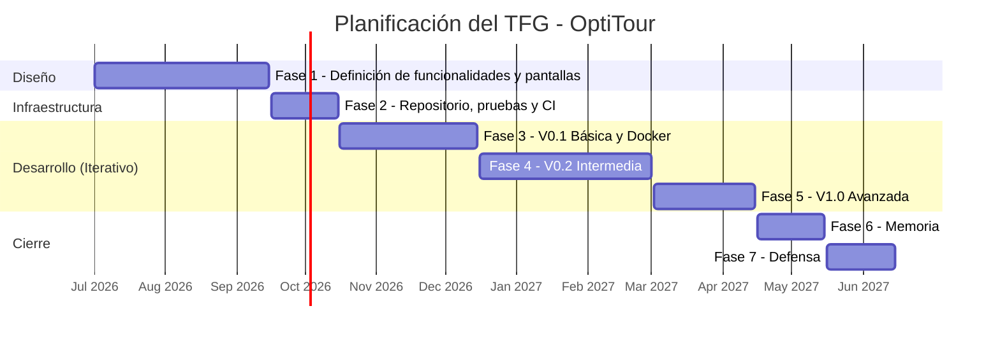

### Funcionalidades detalladas

A continuación se presentan las funcionalidades detalladas, organizadas en una tabla según sean básicas, intermedias o avanzadas:

| Tipo | Funcionalidad | Usuario | Descripción |
| :--- | :--- | :--- | :--- |
| **Básica** | Listado de tours públicos en la página principal | Anónimo | Listado de tours públicos destacados en la página principal |
**Básica** | Consulta de detalle de puntos de interés | Anónimo | Visualización en detalle de los datos de los puntos de interés que contienen los tour |
**Básica** | Creación de puntos de interés | Administrador | Creación de nuevos puntos de interés por parte de un administrador para poder ser incluidos en los tour |
| **Básica** | Consulta de detalle de tour | Anónimo | Consulta de la página de detalle de un tour. |
| **Básica** | Registro de usuario | Anónimo | Registro de nuevas cuentas de usuario. |
| **Básica** | Inicio de sesión | Anónimo | Identificación de usuarios ya registrados. |
| **Básica** | Cierre de sesión | Registrado | Finalización segura de la sesión activa del usuario. |
| **Básica** | Validación de formularios | Todos | Validación en cliente y servidor de todos los campos. |
| **Básica** | Modificación de datos de perfil | Registrado | Edición de los datos asociados a la cuenta de usuario. |
| **Básica** | Gestión de tours | Administrador | Adición, eliminación y edición de tours públicos. |
| **Básica** | Registro de administrador | Administrador | Creación de nuevas cuentas de administración. La primera cuenta vendrá grabada en el código fuente y deberá cambiar su contraseña en el primer inicio de sesión. |
| **Básica** | Bloqueo de usuarios | Administrador | Bloqueo de usuarios que no cumplen las normas de la plataforma, limitando el uso de la misma como usuario registrado. |
| **Básica** | Panel de administrador | Administrador | Página especial para administradores donde se encuentran las funcionalidades para este grupo de usuarios (estadísticas, creación de tours, registro de nuevos administradores o bloqueo de usuarios) |
| **Intermedia** | Lista de amigos | Registrado | Registro y eliminación de amigos en la lista. Gestión de solicitudes de amistad. |
| **Intermedia** | Creación de grupos privados | Registrado | Creación de grupos de usuarios a partir de la lista de amigos. El usuario creador del grupo pasa a ser su líder, con permisos para gestionar miembros y apuntar al grupo a tours. Otros miembros pueden solicitar asumir ese rol desde el detalle del grupo. |
| **Intermedia** | Creación de grupos públicos | Administrador | Creación de nuevos grupos turísticos públicos, a los que cualquier usuario puede unirse. |
| **Intermedia** | Creación de tours privados | Registrado | Registro de un nuevo tour privado a partir de una lista de puntos de interés. |
| **Intermedia** | Notificaciones | Registrado | Recepción de notificaciones en la plataforma (solicitudes de amistad, nuevos tours, etc.)|
| **Intermedia** | Búsqueda por filtros | Anónimo | Filtrado de tours por precio, duración o tipo. |
| **Avanzada** | Cálculo de ruta óptima | Registrado | Cálculo, mediante un algoritmo, de la ruta óptima dentro de los lugares de interés de un tour. Se realiza automáticamente durante la creación de un tour, pero puede actualizarse el resultado por si la ruta cambia con el tiempo según los datos (condiciones de tráfico, obras, etc). Estos datos se obtienen desde una API externa. Se puede calcular la ruta óptima tanto para realizarla caminando como para realizarla en coche. |
| **Avanzada** | Pago de tours premium | Registrado | Pago mediante la pasarela de pago de stripe de tours públicos premium. |
| **Avanzada** | Notificaciones por mensajería | Registrado | Recepción de notificaciones a través de servicio de mensajería externo. |
| **Avanzada** | Búsqueda de tours | Anónimo | Uso el motor de búsqueda avanzado para encontrar tours. |

# Análisis

## Diseño de las pantallas
### Sistema público y autenticación

#### Pantalla principal
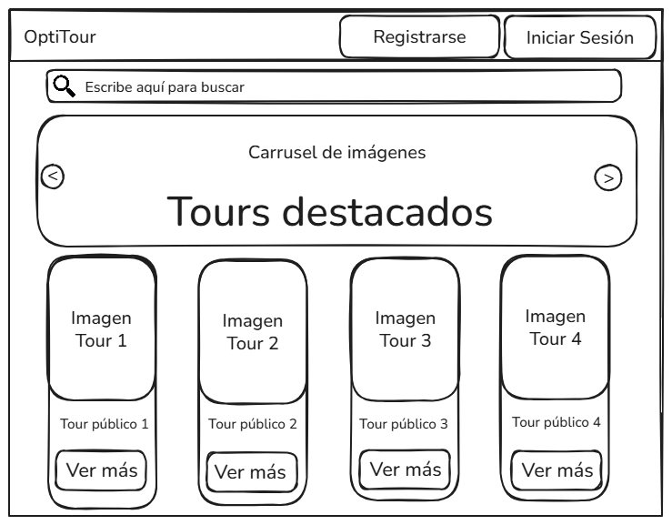

Página principal de la plataforma. Muestra un carrusel de imágenes de tours destacados a modo de portada. Todos los tours públicos pueden consultarse en la lista inferior. Por su parte, se puede utilizar la barra superior para realizar búsquedas de texto avanzadas, para encontrar tanto tours como puntos de interés.

#### Iniciar sesión
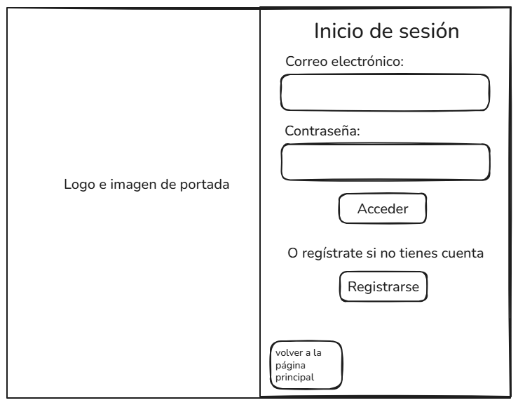

Formulario de inicio de sesión. El inicio de sesión se lleva a cabo mediante correo electrónico y contraseña. Contiene enlaces al registro y de vuelta a la página principal.

#### Registro de usuario
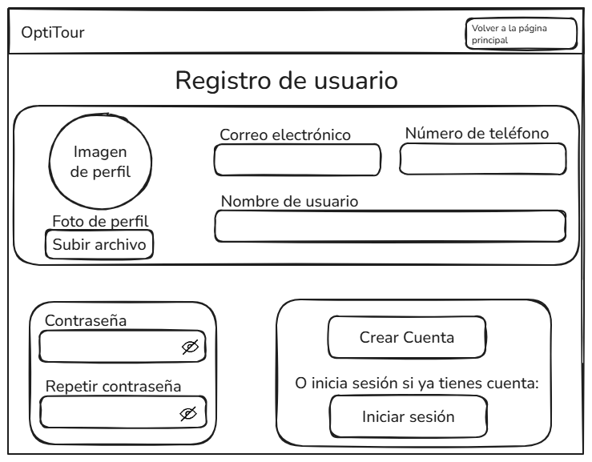

Formulario para registrar una nueva cuenta de usuario. Permite enviar imagen de perfil, correo electrónico, número de teléfono, nombre y apellidos, así como establecer la contraseña. Contiene enlaces al inicio de sesión y de vuelta a la página principal.

#### Detalle de tour público sin iniciar sesión
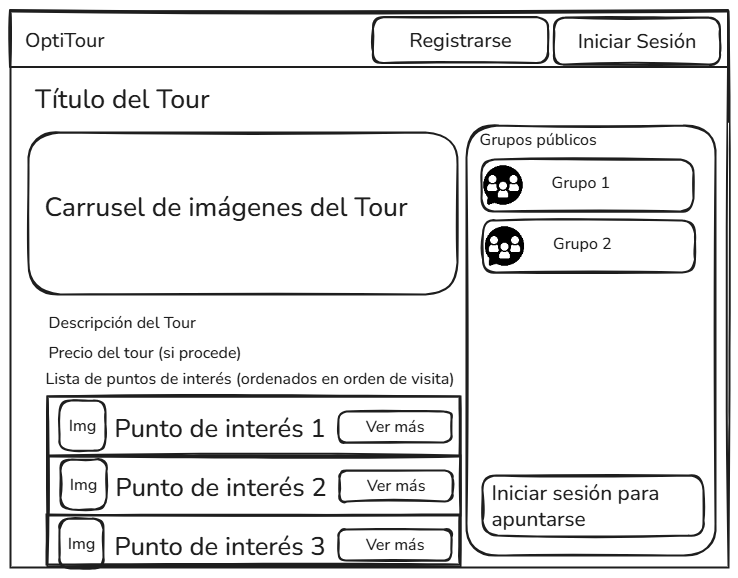

Si el usuario no ha iniciado sesión, tiene permitido consultar los datos básicos del tour, así como la ruta óptima. También puede consultar grupos públicos para poder realizar el tour. No puede apuntarse al tour.

#### Detalle de punto de interés
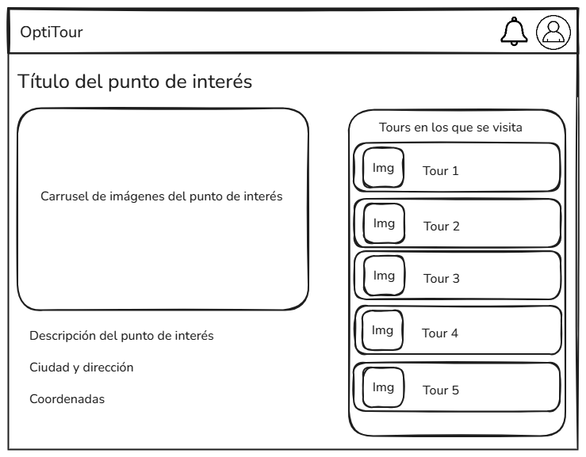

Todos los usuarios tienen los mismos permisos en esta página, debido a que los puntos de interés no pueden utilizarse por sí mismos sin incluirlos en un tour, por lo que se trata de una página meramente informativa que muestra los datos e imágenes de un punto de interés, así como los tours donde dicho punto de interés se visita.

### Usuario registrado

#### Detalle de tour para usuario registrado
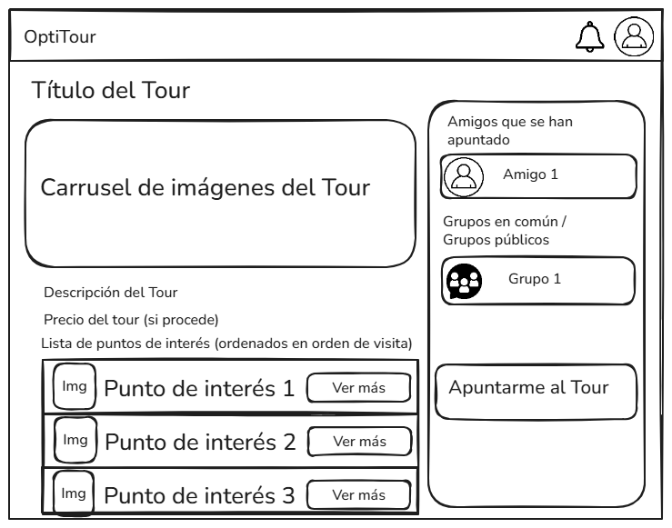

Si el usuario ha iniciado sesión, puede consultar adicionalmente qué amigos suyos se han apuntado al tour, y qué grupos tiene en común, sin perder la posibilidad de consultar grupos públicos. Tiene permitido apuntarse al tour, y realizar el pago si el tour lo requiere.

#### Creación de tour
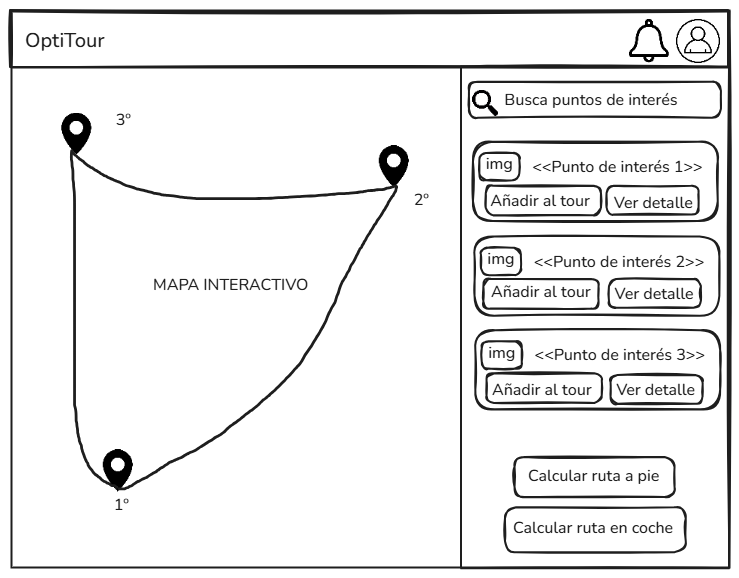

En la lista de la derecha, el usuario puede buscar, consultar y añadir puntos de interés a su tour privado.
A medida que el usuario los añade, se irán marcando los puntos de interés en el mapa interactivo. Una vez haya terminado, pulsará uno de los botones inferiores, según prefiera realizar la ruta caminando o en coche, y se mostrará la ruta óptima sobre el mapa interactivo. Se incluye un itinerario con 3 puntos de interés a modo de ejemplo, una vez el algoritmo haya sido ejecutado.

#### Perfil de usuario
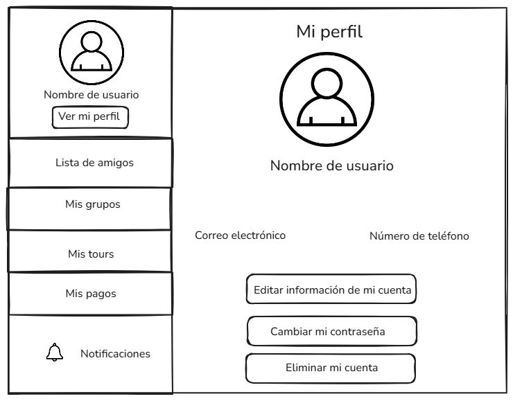

Página que muestra los datos personales de la cuenta de usuario. Permite edición de información personal, de contraseña, y eliminación de la cuenta.

#### Lista de amigos
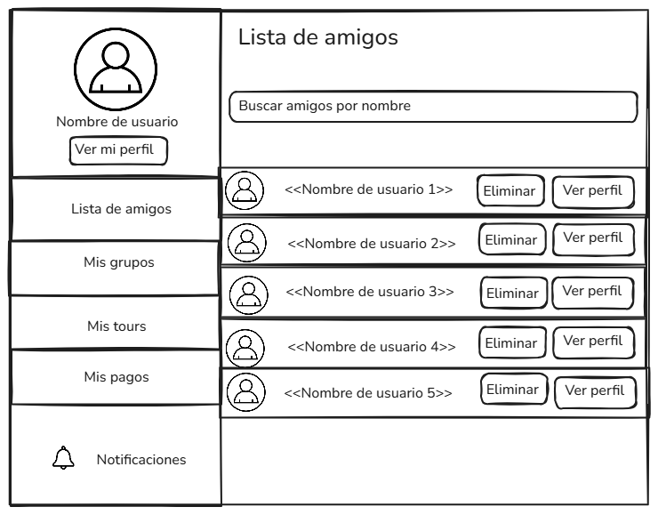

Listado que muestra las cuentas de los perfiles amigos del usuario. Para enviar nuevas solicitudes de amistad, el usuario buscará el nombre su amigo en la barra superior. Cuando el otro usuario acepte la solicitud de amistad, ambos usuarios serán amigos mutuamente. Podrán consultarse los perfiles de los amigos y eliminarlos de su lista.

#### Lista de grupos
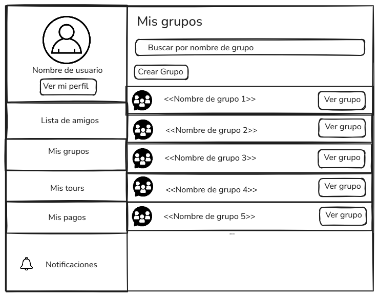

Listado que muestra los grupos en los que se encuentra incluido el usuario. Se podrán buscar los grupos por nombre, ver su detalle y crear un nuevo grupo. Solo podrán crearse nuevos grupos a partir de usuarios que consten en la lista de amigos. El usuario creador del grupo será su líder, rol que ofrece ventajas administrativas como incluir y eliminar usuarios o apuntar al grupo a tours.

#### Detalle de grupo
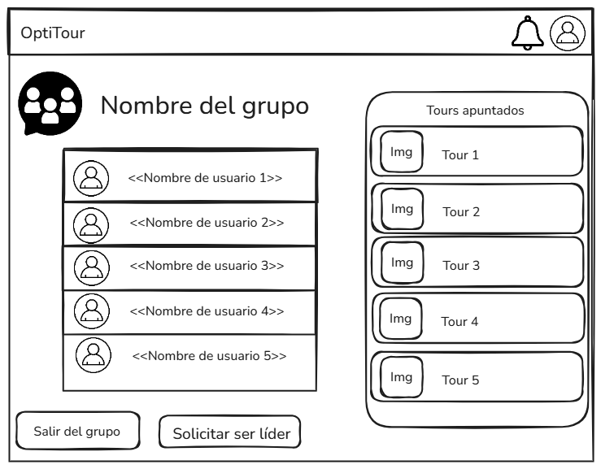

Página que muestra más información acerca de los grupos. Muestra los usuarios incluidos y la lista de tours a los que el grupo se ha apuntado. Permite al usuario abandonar el grupo y solicitar el rol de líder, ya que los grupos no limitan este rol a un único usuario.

#### Listado de tours inscritos
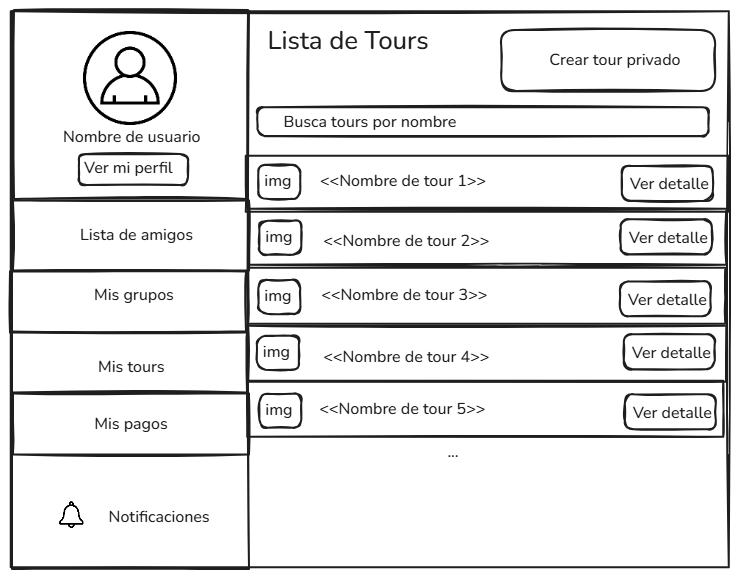

Listado de tours inscritos a nivel individual. A diferencia del listado que aparece en el detalle de grupo, este listado muestra todos los tours inscritos, incluso si son de diferentes grupos. Permite crear un nuevo tour privado, para lo cual el usuario debe estar incluido en al menos un grupo.

#### Notificaciones
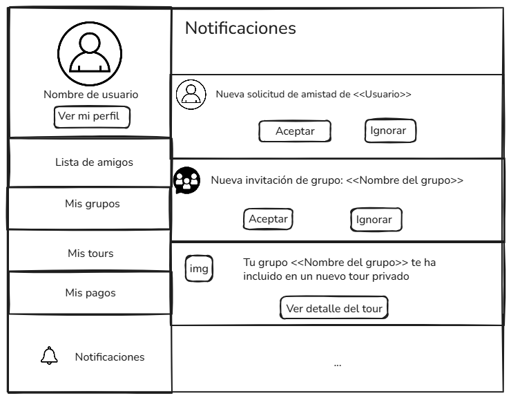

Listado de notificaciones del usuario. Aquí se reciben las solicitudes de amistad, las invitaciones a grupos, inclusiones en tours, entre otra información relevante (por ejemplo, promociones, pagos correctos, inscripciones a tours públicos, etc.).

#### Historial de compras
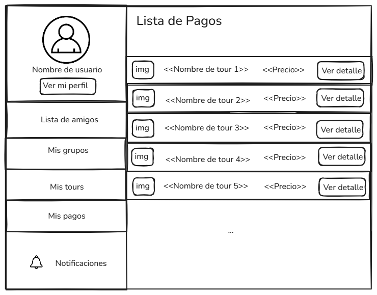

Listado de transacciones realizadas en la plataforma. Las transacciones económicas se utilizan para tours premium en los que OptiTour contrata personal de guía y se hace cargo de alojamiento, transporte, etc.

### Administrador

#### Gestión de usuarios
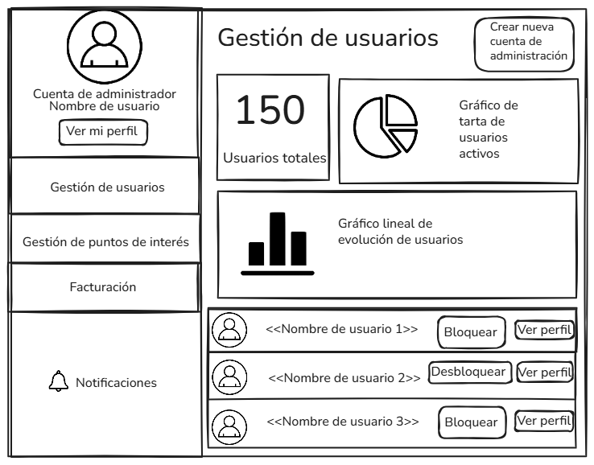

Panel en el que el administrador puede consultar estadísticas generales sobre el uso de usuarios registrados de la plataforma. Además, puede bloquear y desbloquear a aquellos usuarios que incumplan las normas de la plataforma. Por otro lado, se pueden crear nuevas cuentas de administrador desde aquí, estando la primera cuenta de administración grabada en el código fuente y debiendo cambiar su contraseña en el primer inicio de sesión.

#### Gestión de puntos de interés
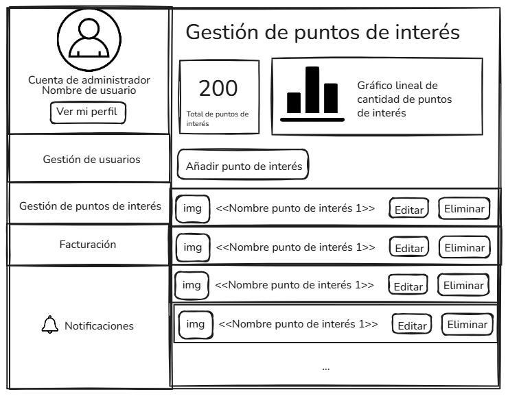

Panel en el que el administrador puede consultar estadísticas generales de los puntos de interés, así como añadir, eliminar, editar y consultar puntos de interés.

#### Gestión de facturas
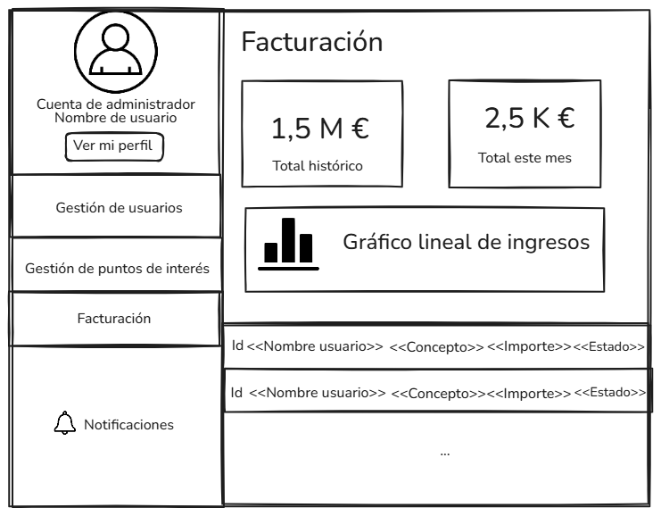

Panel en el que el administrador puede consultar los resultados financieros de la plataforma, desde estadísticas generales hasta las transacciones específicas.

### Navegación general

La navegación de la aplicación parte de la pantalla principal, desde la que se accede al registro, al inicio de sesión, al listado de tours públicos y al detalle de un punto de interés.

Desde el listado de tours públicos se accede al detalle de cada tour. Si el usuario está autenticado, puede además consultar la versión ampliada del detalle, apuntarse al tour, realizar pagos cuando corresponda y acceder a la creación de tours privados.

La zona privada del usuario se concentra en el perfil, desde donde se accede a la gestión de amigos, grupos, notificaciones e historial de compras.

La zona de administración agrupa la gestión de usuarios, puntos de interés y facturas, manteniendo centralizadas las tareas de control de la plataforma.

## Entidades y Relaciones
Se presentan a continuación las entidades que conformarán el sistema. Se asume que todas las entidades tienen un atributo que las identifica unívocamente: 

| Entidad | Atributos | Relaciones | Descripción |
| :--- | :--- | :--- | :--- |
| **Usuario** | • E-mail   • Contraseña   • Nombre de usuario   • Número de teléfono   • Foto de perfil   • Lista de amigos   • Lista de grupos   • Lista de notificaciones • Usuario activo   • Lista de roles| • Grupo - N:M   • Amigos - N:M (recursiva)   • Tour - N:M   • Notificación - 1:N | Cuenta de usuario registrado. |
| **Grupo**    | • Lista de usuarios   • Lista de tours   • Usuario líder del grupo | • Usuario - N:M   • Usuario - 1:M   • Tour - N:M | Conjunto de usuarios que pueden contratar tours en conjunto o crear sus propios tour personalizados. La gestión (creación, borrado, definición de más líderes, inclusión y eliminación de usuarios de la lista de amigos) la lleva a cabo un usuario con el rol de "líder", siendo éste el usuario creador del grupo, con posibilidad de ampliación. |
| **Punto de interés** | • Nombre   • Descripción   • Ciudad   • Dirección   • Coordenadas   • Lista de imágenes   • Precio (si es premium) | • Tour - N:M | Lugar que a los usuarios del sistema les resulta interesante visitar. Es el elemento básico de los tour, siendo los destinos que el algoritmo utilizará para calcular las rutas. |
| **Tour** | • Nombre   • Descripción   • Lista de lugares de interés | • Punto de interés - N:M | Conjunto de puntos de interés de la misma temática que se visitan en un orden definido por el sistema para poder recorrerlos en tiempo óptimo. Pueden ser públicos, publicados por un administrador, o privados, organizados por grupos de usuarios que solo dicho grupo puede ver. |
| **Notificación** | • Título   • Cuerpo   • Leída/No leída | • Usuario - N:1 | Mensajes que alertan al usuario acerca de novedades de su interés dentro de la plataforma. Por ejemplo, solicitudes de amistad, invitaciones a grupos o información sobre nuevos tours públicos. |
| **Transacción** | • Concepto   • Importe   • Estado   • Fecha | • Usuario - N:1 | Registro de una operación económica realizada por un usuario dentro de la plataforma. |

## Permisos de usuarios

| **Rol de usuario** | **Permisos** |
| :--- | :--- |
| **Anónimo** | • Visualización de la página principal.   • Consulta de catálogo de tours públicos y puntos de interés.   • Registro en la plataforma.   • Búsqueda de tours. |
| **Registrado** | • Gestión completa de su perfil (editar datos, foto)   • Gestión de lista de amigos (añadir, eliminar y consultar amigos)   • Creación y gestión (invitar a amigos, unirse, eliminar) de grupos de viaje privados.   • Creación y edición de tours privados personalizados.   • Recepción de notificaciones.   • Cálculo de rutas óptimas.   • Realización de pagos mediante Stripe. |
| **Administrador** | • Gestión (creación, lectura, modificación y borrado) de puntos de interés y tours públicos.   • Creación de grupos turísticos públicos.   • Bloqueo y desbloqueo de usuarios.   • Acceso a estadísticas mediante panel de administración. |

## Imágenes

| **Entidad** | **Descripción de las imágenes** |
| :--- | :--- |
| **Usuario** | • Una imagen de perfil por usuario |
| **Punto de interés** | • Una o varias imágenes que muestren el lugar turístico |
| **Tour** | • Una imagen de portada representativa del itinerario del tour |
| **Grupo** | • Una imagen de icono de grupo |

## Gráficos

Todos los gráficos se mostrarán en el panel de administrador.

| **Información a mostrar** | **Tipo de gráfico** |
| :--- | :--- |
| **Ingresos:** Evolución de los ingresos generados por la plataforma a lo largo del tiempo. | Lineal |
| **Cantidad de puntos de interés:** Evolución del número de puntos de interés disponibles en la plataforma. | Lineal |
| **Usuarios activos vs bloqueados:** Comparación entre usuarios activos y usuarios bloqueados. | Tarta |
| **Evolución de usuarios:** Crecimiento o variación del número total de usuarios registrados. | Lineal |

## Tecnología complementaria

Como tecnología complementaria, la plataforma hará uso de la API externa de algún sistema de mapas (por ejemplo, Google Maps) para obtener los datos necesarios para optimizar las rutas de los tours. Asimismo, el sistema utilizará Telegram para enviar notificaciones a los usuarios que lo deseen.

## Algoritmo o consulta avanzada

Como ya se ha descrito anteriormente, el algoritmo avanzado de la aplicación consiste en un algoritmo de optimización de rutas entre varios puntos, tratándose más concretamente de la resolución de una variante Problema del Viajante. Estos cálculos se realizarán a partir de los datos obtenidos mediante la API externa escogida como tecnología complementaria. El algoritmo podrá ejecutarse en dos modalidades: para recorrer los puntos de interés caminando o en coche (ya que las aplicaciones de mapas suelen ofrecer estas rutas por separado). El algoritmo se ejecutará automáticamente una primera vez durante la creación del tour, pero el usuario podrá actualizar el resultado cuando el tour dé comienzo (ejecutando el algoritmo de nuevo) para tener en cuenta posibles obstáculos temporales como atascos, obras accidentes, etc.